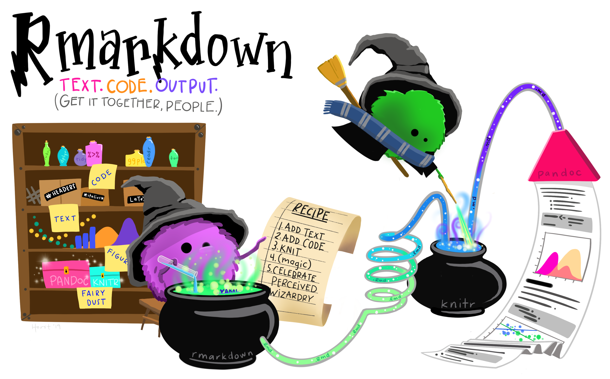

class: center,  middle, hide_logo


<head>
<script src="https://kit.fontawesome.com/994a28441d.js" crossorigin="anonymous"></script>
</head>

```{r xaringan-themer, echo=F, warning=FALSE}
library(xaringanthemer)
library(fontawesome)
library(xaringanExtra)

extra_css <- list(
  ".cit"  = list("font-size" = "70%",
                 "color" = "#6AEE3E90"),
  ".em05" = list("font-size" ="0.5em"),
  ".em06" = list("font-size" ="0.6em"),
  ".em07" = list("font-size" ="0.7em"),
  ".em08" = list("font-size" ="0.8em"),
  ".em09" = list("font-size" ="0.9em"),
  ".em11" = list("font-size" ="1.1em"),
  ".em12" = list("font-size" ="1.2em"),
  ".em13" = list("font-size" ="1.3em"),
  ".em14" = list("font-size" ="1.4em"),
  ".em15" = list("font-size" ="1.5em"),
  ".em16" = list("font-size" ="1.6em"),
  ".em17" = list("font-size" ="1.7em"),
  ".em18" = list("font-size" ="1.8em"),
  ".em19" = list("font-size" ="1.9em"),
  ".bold" = list("font-weight" = "bold"),
  ".large" = list("font-size" = "160%"),
  ".vertmiddle" = list("vertical-align" ="middle"),
  #".lh15" = list("line-height" =  "1.5"),
  ".li" = list("line-height" =  "1.5",
               "font-size" = "160%",
               "font-weight" = "bold"),
  ".phgreen" = list("color" = "#50B32E"),
  ".phgreenlight" = list("color" = "#62DC3A"),
  ".pgl" = list("color" = "#62DC3A"),
  ".phg" = list("color" = "#8cd000"),
 # ".my-footer" = list("background-color" = "#1a1917",
 #                     "position" = "absolute",
 #                     "bottom" = "0px",
 #                     "left" = "0px",
 #                     "height" = "20px",
 #                     "width" = "100%"),
  ".my-footer span" = list("font-size" = "10pt", 
                           "color" = "#F7F8FA",
                           "position" = "absolute",
                           "left" = "15px",
                           "bottom" = "2px"),
  ".remark-slide-number" = list("bottom" = "-18px"),
  ".li" = list("line-height" =  "4"),
  ".scroll-box-18" = list("height" ="18em",
                           "overflow-y" = "scroll"),
  ".scroll-box-23" = list("height" ="23em",
                           "overflow-y" = "scroll"),
  ".hscroll-box-30" = list("width" ="23em",
                           "overflow-x" = "scroll"))

style_mono_accent_inverse(
  base_color = "#8cd000",
  white_color = "#FFFFFF",
  black_color = "#272822",
  inverse_background_color = "#ffffff",
  extra_css = extra_css)

library(xaringanExtra)
use_logo(
  image_url = "https://apps.samuel-merk.de/data/PHK_2018_Logo_V1_FARBE_NUR_PH.svg",
  width = "80px",
  position = xaringanExtra::css_position(top = "1em", right = "1em")
)

use_editable() 
```


.phg[
# Workshop]

```{r echo=FALSE, out.width="40%"}

```

.phg[### Reproduzierbare Analysen mit RMarkdown]

---  
.em14[.phg[Samuel Merk | PH Karlsruhe]]

`r typedjs::typed(c("Hallo und 💚-lich Willkommen!", "Der Workshop soll eine Hands-On Einführung in RMarkdown sein.", "Wichtig wäre dazu, dass ihr R und RStudio installiert habt sowie die R-Pakete {rmarkdown} und {tinytex}", "Diese Folien findet ihr unter https://bit.ly/merk027"), typeSpeed = 80, backSpeed = 20, backDelay = 3000, loop = T, contentType = "html")` 


---
# Mein Plan bis 16:00
.large[
* Was ist Reproduzierbarkeit?
* Meta-Scientifische Befunde zur Reproduzierbarkeit
* RMarkdown
    * Founding principles
    * Worked out example
    * Example to be worked out
    * Sophistications on demand]

---
## Das (theoretische) Reproduzierbarkeitsspektrum
```{r, fig.cap = "Das Reproduzierbarkeitsspektrum. Abbildung aus (Peng, 2011)", out.width = "100%", fig.align='center', echo=FALSE}
knitr::include_graphics("Img/peng_spectrum.png")
```

---
## Die (reale) Verteilung auf diesem Spektrum I
```{r, echo = F, fig.align='center', out.width="50%", fig.cap="Aus Hardwicke et al. (2018)"}
knitr::include_graphics("Img/screenshot_hardwicke.jpg")
```

---
## Die (reale) Verteilung auf diesem Spektrum II
* Ergebnisse aus Stockemer et al. (2018):
    * Drei politikwiss. Journals (71 Artikel)
        * 32 exakt replizierbare Analysen
        * 19 »minor errors«
        * 3 »significantly different«
        * 16 »replication was not possible« 
* Ergebnisse aus Stodden et al., (2018):
    * Zwei Jahrgänge _Science_ (204 Artikel)
        * In 13% Informationen zum Bezug von Daten oder Code
        * In 44% Artefakte beziehbar
        * In 26% Reproduzierbarkeit 

---
# R-spezifische Werkzeuge        
```{r, fig.cap = "Einstiegshürde vs. Reproduzierbarkeit", out.width = "80%", fig.align='center', echo=FALSE}

```

---
# Reproducible Reporting with JASP        
```{r, fig.cap = "siehe jasp-stats.org", out.width = "90%", fig.align='center', echo=FALSE}

```


---
class: middle center hide_logo
# Founding principles

---
class: inverse
```{r, echo = F, out.width="85%", fig.align='center', fig.cap="The founding principle of RMarkdown (by @allison_horst)"}

```

---
## How it works
```{r, echo = F, out.width="90%", fig.align='right'}

```

---
# Entrance to the rabbit whole 
* RStudio Cheatsheets
    * RStudio $\Rightarrow$ Help $\Rightarrow$ Markdown Quick Reference
    * [RMarkdown](https://github.com/rstudio/cheatsheets/blob/main/rmarkdown-2.0.pdf)
    * [RStudio](https://github.com/rstudio/cheatsheets/blob/main/rstudio-ide.pdf)
* [R Markdown: The Definitive Guide](https://bookdown.org/yihui/rmarkdown/) (Xie et al., 2018)    

---
class: middle center
# Worked out example
RStudio --> New Project --> Version Control --> Git --> URL: https://github.com/sammerk/RMD_WS_WSOS22_Worked_out_example.git

---
class: middle center
# Example to be worked out
RStudio --> New Project --> Version Control --> Git --> URL: https://github.com/sammerk/RMD_WS_WSOS22_Example_to_be_worked_out

---
# Sophistications on demand
.pull-left[
### For Starters ...
.can-edit[
* pdf vs. html vs. word
* .Rmd-templates
    * `{rmdformats}`
    * `{tint}`
    * `{prereg}`
* sharing/publishing
* ...
]]

.pull-left[
### ...and Ninjas/Kunoichis
.can-edit[
* Embedding
    * pdf
    * html
    * arbitrary files `{xfun}`
* Weitere engines (MPlus, TikZ, Python, ...)
* ...
]]

---
## Literatur
Hardwicke, T. E., Mathur, M. B., MacDonald, K., Nilsonne, G., Banks, G. C., Kidwell, M. C., Hofelich Mohr, A., Clayton, E., Yoon, E. J., Henry Tessler, M., Lenne, R. L., Altman, S., Long, B., & Frank, M. C. (2018). Data availability, reusability, and analytic reproducibility: Evaluating the impact of a mandatory open data policy at the journal Cognition. Royal Society Open Science, 5(8), 180448. https://doi.org/10.1098/rsos.180448  
Peng, R. D. (2011). Reproducible research in computing science. Science, 334(6060), 1226–1227. https://doi.org/10.1126/science.1213847.Reproducible  
Stockemer, D., Koehler, S., & Lentz, T. (2018). Data access, transparency, and replication: New insights from the political behavior literature. PS: Political Science & Politics, 51(4), 799–803. https://doi.org/10.1017/S1049096518000926  
Stodden, V., Seiler, J., & Ma, Z. (2018). An empirical analysis of journal policy effectiveness for computational reproducibility. Proceedings of the National Academy of Sciences, 115(11), 2584–2589. https://doi.org/10.1073/pnas.1708290115  
Xie, Y., Allaire, J. J., & Grolemund, G. (2018). R Markdown: The definitive guide. CRC Press.


